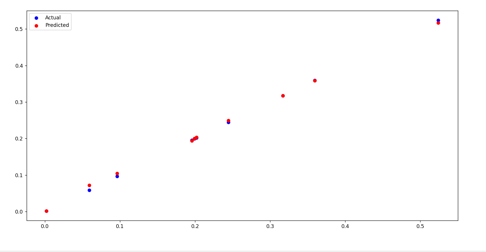

# Mango Yield Prediction using Machine Learning for Smart Agriculture

## Overview
This project aims to predict mango production based on environmental factors such as temperature, humidity, and rainfall using machine learning techniques.

It represents an application of data science in **Digital Agriculture (Smart Farming)** to support decision-making and optimize crop yield.

---

## Problem Statement
Crop yield prediction is a critical challenge in agriculture, as environmental conditions directly impact productivity.

Farmers need data-driven tools to:
- Estimate production in advance
- Optimize irrigation and resource planning
- Reduce uncertainty in farming decisions

---

## Dataset
- Synthetic dataset (generated to simulate real environmental conditions affecting mango production)
  
- Features:
  
  - Temperature
  - Humidity
  - Rainfall
    
- Target:
  - Mango yield

---

##  Methodology
- Data preprocessing and analysis using Pandas
- Feature engineering (e.g., nonlinear relationships such as Temperature², Humidity²)
- Model: Linear Regression (baseline model)
- Train-test split applied to evaluate model performance
- Evaluation metrics:
  - R² Score
  - Mean Squared Error (MSE)
 
---

## Results
- Achieved high model accuracy: **R² ≈ 0.99 on test data**
- Demonstrated ability to capture nonlinear relationships between environmental factors and yield

---

##  Relevance to Digital Farming
This project demonstrates how machine learning can be used to:
- Predict crop yield
- Support precision agriculture
- Enable data-driven farming decisions

---

## Technologies Used
- Python
- NumPy
- Pandas
- Matplotlib
- Scikit-learn

---

## Model Performance

---

## Future Improvements

- Use real-world agricultural datasets
- Integrate IoT-based sensor data
- Deploy as a decision-support tool for farmers

---

## Conclusion

- This project highlights the potential of machine learning in improving agricultural productivity and supports the transition toward data-driven and smart farming systems

---

## 👤 Author
Hany Atya
